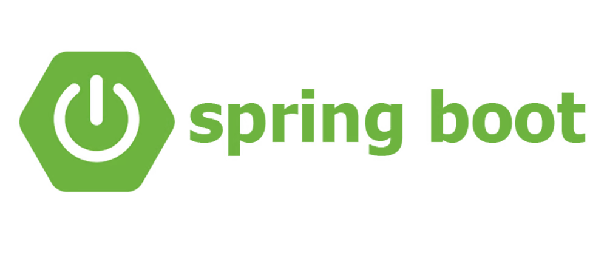
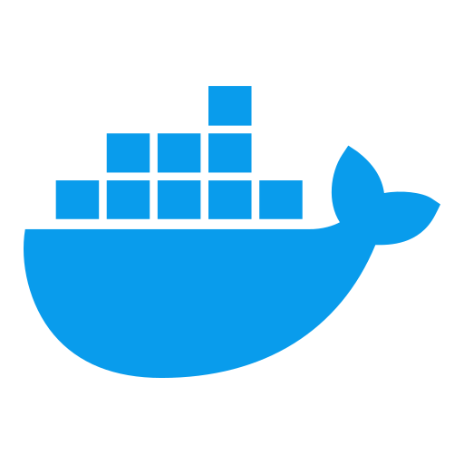
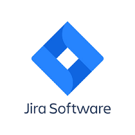
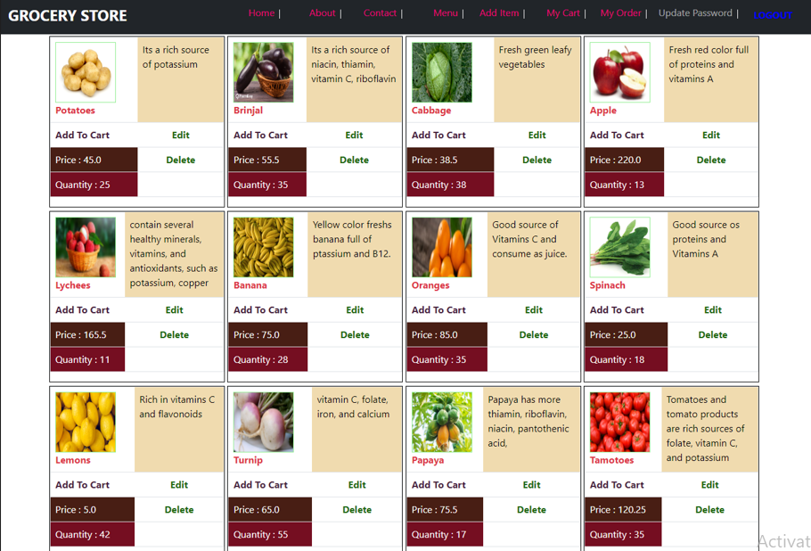
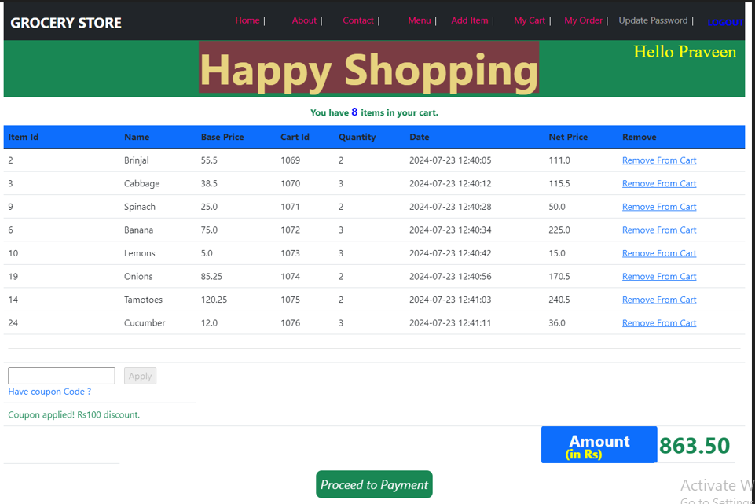
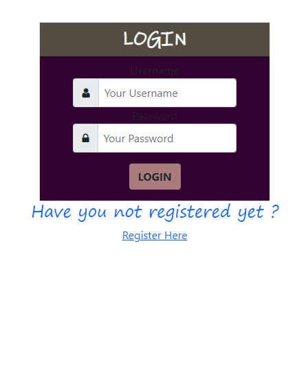
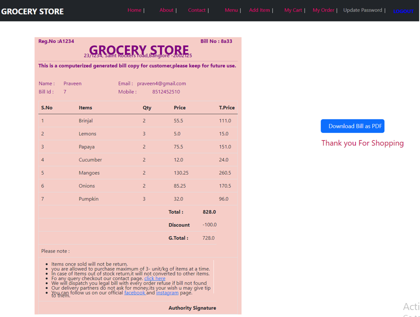

<h1 align="center">
  
</h1>
 <h2 align="center">  Hello,I'am Praveen Nischal Software Developer and Teacher from    </h2>

 I love coding and have completed my Master’s in Computer Science. I recently passed a post graduate diploma in Advanced Computing from CDAC, Noida with a grade A. As a teacher and mentor, I enjoy facing challenges and strive to contribute my skills and knowledge in every aspect of life. 

### Currently Working on :
- currently revising Spring Boot, learning React.js,& exploring microservices and RESTful APIs to enhance my full stack development skills.

   

### Bio :
- 🥂 Area of interest is in working with  and 
- especially with using   and   architecture
- Looking to collaborate on  project with developers
-  ping me about , , ,  
-  Reach me : 

 

 ## My Skill Set  
<table><tr><td valign="top" width="25%">

### Frontend  

  
  
  
   
  

</td><td valign="top" width="25%">

### Backend  

  
  
  
  
  
  
  
  
  
  

</td><td valign="top" width="25%">

### DevOps  

  
  
   
  
  
  

</td><td valign="top" width="25%">

### Tools  

  
  
  
  
  
  
 

</td></tr>
</table>  

   

## Projects worked on 

| Name | Technologies Used | Description | Link Repositories |
| --- | --- | --- | --- |
| Online Auction System          | ASP.NET, C#, HTML4, CSS, Bootstrap, Javascript,SQL Server 2008 | Online Auction System has three section Bidder(User), Auctioneer, Admin ; Admin can make available product for auction auctioneer manage that product nad bid and finally bidder can bid if bid is minimum won the auction. | 
| Cineplanet | Spring Boot,Hibernate, HTML5, JSP,Spring Security,JPA,Mysql, CSS, Bootstrap |  Cineplanet has two section user and Admin; Admin make available a list of movies and user can buy a tickets and book his seat from particular theatures(Screen) and finally generate his ticket. | <a href="https://github.com/Praveen-nischal4/Cineplanet.git" title="github"> Cineplanet </a> |
| Grocery Store | Spring-framweork,Spring-security,Mysql,jsp,JDBC-Template,HTML,CSS,Bootstrap | Grocery Store is a Spring based project also uses Spring-security and has two section Admin and User(Customers); Admin  create menu which is available for customers and customer can add items tocart  and buy vegetables,fruits,drinks also for giving grocery store real ecommerce feel a coupon module and billing module is also developed and user can download there bill in pdf form after shopping. | <a href="https://github.com/Praveen-nischal4/OnlineGroceryStore-Application.git" title="github"> GroceryStore </a> |
| Portfolio Website | Wordpress, Elemetor-plugin,Mysql(DB) | This is my Personal Portfolio Website created on Wordpress | <a href="https://www.praveennischal.com" title="portfolio"> PortfolioWebsite </a> |
| Patient Dashboard | Servlet, HTML5, CSS, Bootstrap, Js | This is a mini project which help patient to manage its dashbaord | <a href="https://github.com/Praveen-nischal4/PatientManagementSystem.git" title="portfolio"> PatientDashboard </a> |

 

<h2 align="center">👨‍💻 Repositories 👨‍💻</h2>
 

  

      

  

      

  

      

 Connect to Me :    
    
                   
<h5 align="center">
 
 

  

</h5>

## Recent Work
| Some ScreeenShots  | of Grocer Store Project |
| --- | --- |
|  |  |
|  |  |
| for more |  <a href="https://github.com/Praveen-nischal4/OnlineGroceryStore-Application.git" title="github" text-align="center"> GroceryStore </a> |
Don't just fork it 👀 Star it ⭐

## ⚡ GitHub Stats

 
     

 <samp>&#9776;</samp>Click for Updates to Come <i>(click to expand) 🔗</i> 

<h4> Coming  : </h4>
  ## Spring Boot REST API Concept  
  

